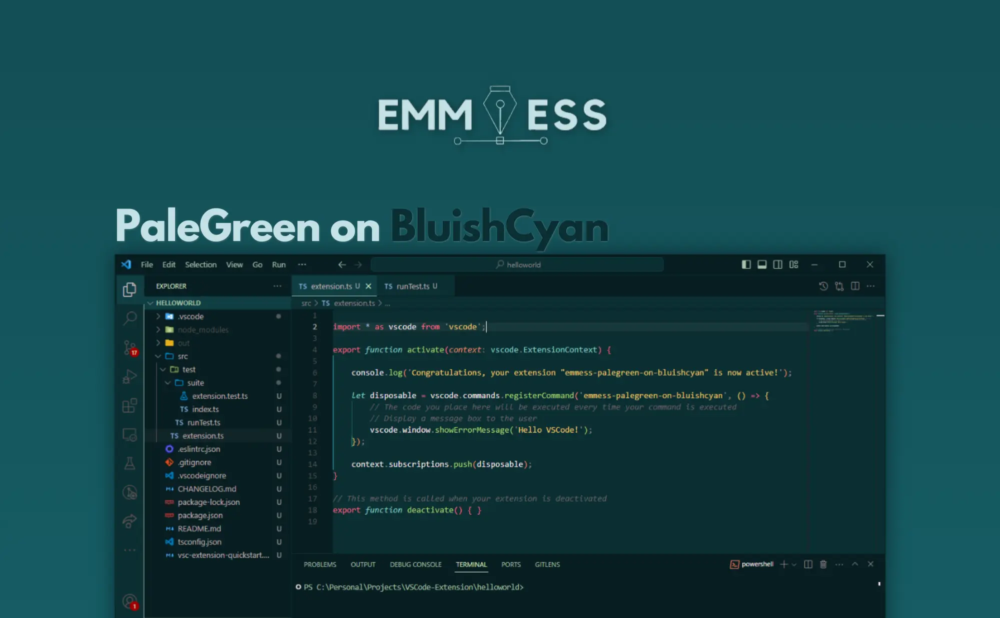
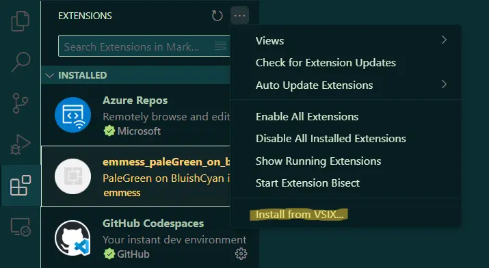

# PaleGreen-on-BluishCyan by emmess

#### Low contrast VSCode theme for a better coding experience.

  

## Installation 
The theme is published at [OpenVSX](https://open-vsx.org/extension/emmess/emmess-palegreen-on-bluishcyan) and is available to download.

Open VSCode, select ***Extensions*** (Ctrl+Shift+X), click to the `...` menu on the top right cornet of extensions panel and select `Install from VSIX...`.   

  

 
Navigate to the downloaded `.vsix` file and select. After sucessfully selecting, the theme should be available between the Extensions, select it and click `Set Color Theme`.  
***Enjoy*!** 